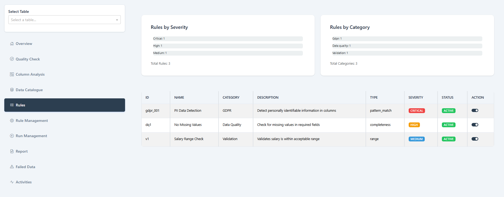
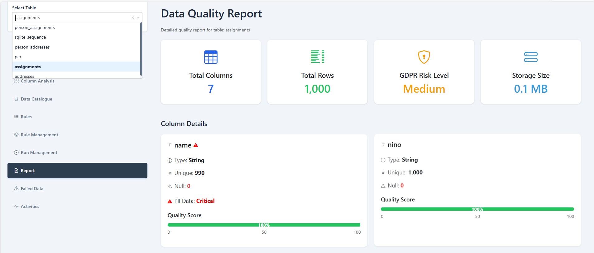

# Data Quality Management Dashboard

> **Note**: This documentation was generated with the assistance of artificial intelligence (Codeium AI) on December 18, 2024. While the content has been verified for accuracy, users should review and validate all information for their specific use cases.

This dashboard provides a comprehensive interface for managing data quality rules and monitoring data validation across your data pipeline. Built with Dash and Python, it offers an intuitive way to manage and configure data quality rules.

## Features

### Rule Management
- View and manage all data quality rules in one place
- Toggle rules between active and inactive states
- Filter rules by category, severity, and status
- Real-time status updates with visual feedback
- Comprehensive statistics on rule usage and distribution

### Run Management
- Execute active rules against your data
- Track rule execution history and trends
- Monitor pass/fail rates over time
- View execution duration statistics
- Generate non-technical summaries of rule results
- Analyze temporal patterns in data quality

### Rule Categories
The system supports multiple types of data quality rules:

1. GDPR Rules
   - Personal data detection (email, phone, SSN)
   - Financial information detection (credit cards, bank accounts)
   - Authentication data monitoring (API keys, tokens)
   - Location data identification (GPS, IP addresses)
   - Device identifiers (MAC addresses)

2. Table Level Rules
   - Structure validation
   - Growth rate monitoring
   - Update frequency checks
   - Schema stability verification
   - Data freshness validation
   - Cross-column correlations
   - Temporal pattern analysis
   - Distribution stability checks

3. Data Quality Rules
   - Format validation (dates, currency, URLs)
   - Precision and range checks
   - String pattern validation
   - Case consistency verification
   - Whitespace and special character checks
   - JSON and numeric format validation

4. Business Rules
   - Business logic validation
   - Cross-table relationships
   - Custom business constraints

## Configuration

### Rule Templates
Rules are configured through `rule_templates.json`. Each rule has the following structure:

```json
{
    "id": "rule_001",
    "name": "Rule Name",
    "description": "Rule Description",
    "category": "Category",
    "type": "Rule Type",
    "severity": "Critical|High|Medium|Low",
    "validation_code": "Python validation code",
    "message": "Error message",
    "active": true|false
}
```

### Adding New Rules
To add new rules:

1. Update `rule_templates.json` with your rule definition
2. Follow the existing rule structure
3. Ensure unique rule IDs
4. Restart the application to load new rules

## Installation

1. Clone the repository
2. Install required packages:
```bash
pip install dash dash-bootstrap-components pandas polars sqlite3 plotly
```

3. Configure your environment:
   - Set up database connections in `config.py`
   - Customize rule templates in `rule_templates.json`

## Project Structure

```
project/
├── BONUS/
│   ├── main_app.py          # Main dashboard application
│   ├── data_loader.py       # Data loading and rule management
│   ├── config.py            # Configuration settings
│   ├── rule_templates.json  # Rule definitions
│   └── rule_execution_history.json  # Execution history storage
```

## Running the Application

1. Navigate to the project directory
2. Run the application:
```bash
python BONUS/main_app.py
```
3. Access the dashboard at `http://127.0.0.1:8050`

## Rule Management Interface

The Rule Management page provides:

1. Statistics Dashboard
   - Total number of rules
   - Active rules count
   - Category distribution
   - Severity breakdown

2. Filtering Options
   - Filter by category
   - Filter by severity level
   - Filter by rule status

3. Rule Actions
   - Toggle rule status
   - View rule details
   - Monitor rule statistics

## Run Management Interface

The Run Management page offers:

1. Execution Controls
   - Execute active rules
   - View real-time execution status
   - Track execution duration

2. Performance Metrics
   - Pass/fail rates
   - Execution duration trends
   - Rule execution history

3. Analysis Tools
   - Trend visualization
   - Performance charts
   - Historical comparisons

## Error Handling

- Visual feedback for rule status changes
- Error messages for failed operations
- Graceful handling of missing data
- Safe rule status persistence
- Execution failure tracking

## Contributing

To contribute:

1. Fork the repository
2. Create a feature branch
3. Submit a pull request with your changes
4. Ensure all existing tests pass

## Troubleshooting

If you encounter issues:

1. Check the console for error messages
2. Verify rule template format
3. Ensure all required packages are installed
4. Check database connections if applicable
5. Review rule execution history for errors

## Educational Notebooks

### Automated Data Quality Checks Implementation
This notebook covers the implementation of automated data quality checks. It includes setting up validation rules for HR data and creating a reporting mechanism for data quality issues.

### Regular Data Quality Monitoring
Focuses on setting up automated monitoring schedules, creating a quality metrics dashboard, and implementing an alert system for quality issues.

### Continuous Improvement Framework for Data Quality
Implements a framework for continuous improvement, including quality metrics analysis, root cause analysis, improvement recommendations, and implementation tracking.

## Screenshots

### Home Screen

*The home screen provides an overview of the dashboard without any table selection.*

### Sidebar Navigation

*The sidebar allows easy navigation between different sections of the dashboard.*

### Data Catalogue

*The data catalogue displays metadata about available tables and columns.*

### Column Analysis

*The column analysis section provides detailed insights into individual column data quality.*

### Rule Management

*Manage data quality rules, toggle their active states, and view statistics.*

### Rules Overview

*An overview of all rules, categorized for easy access and management.*

### Run Management

*Track rule execution history, monitor pass/fail rates, and view execution statistics.*

### App Activity

*Visualize recent activities and interactions within the app.*

## License

This project is licensed under the MIT License - see the LICENSE file for details.

---
*Note: This documentation is maintained with AI assistance (Codeium AI, 2024) as part of an ongoing effort to ensure comprehensive and up-to-date information. Users are encouraged to provide feedback and suggest improvements.*
